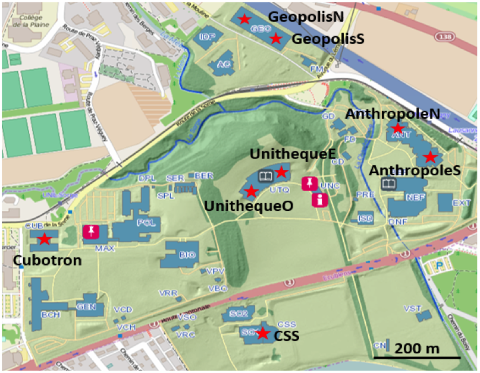

```{r,echo = FALSE}
start_time <- Sys.time()
```

# Overview

The three raw datasets we're working with contain information of precipitation data collected from University of Lausanne.
To review the application, we briefly describe each of the data below.

# Libraries

```{r load_libs, message=FALSE}

library(here)
library(readr)

```


```{r}
if (!dir.exists(here("results"))) {
  cat("creating results/ directory\n")
  dir.create(here("results"))
}
```


# Two Datasets of Rainfall Amount

## Text Description

> Two datasets are the same precipitation observations measured by different units

> Both are stored and downloadable in the figshare page, 

https://figshare.com/s/194f6f08521d114c0531

https://figshare.com/s/0abf4fe1da342339fb88


> We download them by running 01_gather_data.R and save them as 
RaindataPerepoch.csv and RaindataPerhour.csv

> The first file RaindataPerepoch.csv is the raw data collected by rain gauge network.
It collect the counts of drops per epoch (1count=0.01mm rain height).

> The second file RaindataPerhour.csv is the transformed data from raw data.
It has standard unit (mm per hour)

## File Examination

```{r load_raindata, warning=FALSE}

rain1_table <- read.csv(here("data", "RaindataPerepoch.csv"), header=TRUE)
rain2_table <- read.csv(here("data", "RaindataPerhour.csv"), header=TRUE)

dim(rain1_table)
dim(rain2_table)

rain1_table[1:5, ]

```

Both files are comma-delimited with a 28802 rows: 1 header row and 28801 data rows, 
where each row corresponds to the accumulated rainfall amount at last 30 sec.

There are 9 columns in the dataset. The first column lists the date and time
(rownames), and the rest give the time series at each location, 
where the location names are shown in the header row.

Since the two datasets measure the same precipitation events, 
we only focus on the raw dataset

Look at the first 5 rows, we notice that all values are zero. 
It motivates us to see how many zeros and the distribution of the dataset.

```{r check_distribution, eval = FALSE}
par(mfrow=c(2,4))
for(i in 1: 8) hist(rain1_table[,i + 1])
table(rain1_table[,2])/28801
```

As we can see, around 90% of observations are zeros indicating the dry events
The tails are heavy since many extreme values. 
The patterns at eight locations are similar, which may indicate strong spatial correlations

# The coord Data

## Text Description

Again, it can be downloaded from the figshare page

https://figshare.com/s/2a4f6e9acddac309cbe9




> It contains the spatial information of 8 measuring locations

## File Examination

```{r coord, warning=FALSE}

coord <- read.csv(here("data", "coords.csv"))
dim(coord)
coord$Easting <- coord$Easting/1000
coord$Northing <- coord$Northing/1000
dist(coord)
```

These dataset only includes 9 rows and 3 columns. 
It is safe the report everything. The actually locations are shown in figure 1,
and we calculate the Euclidean distance, although it maybe not precise.

## Running Time
```{r, echo = FALSE}
end_time <- Sys.time()

runtime_02 <- end_time-start_time

runtime_02
```
