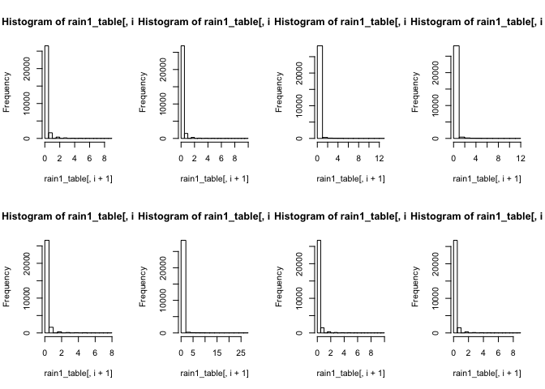

Describing the Raw Data
================
Yuxiao Li
2018-04-23

-   [Overview](#overview)
-   [Libraries](#libraries)
-   [Two Datasets of Rainfall Amount](#two-datasets-of-rainfall-amount)
    -   [Text Description](#text-description)
    -   [File Examination](#file-examination)
-   [The coord Data](#the-coord-data)
    -   [Text Description](#text-description-1)
    -   [File Examination](#file-examination-1)

Overview
========

The three raw datasets we're working with all contain information of precipitation data collected from University of Lausanne. For review, we briefly describe each of the three below.

Libraries
=========

``` r
library(here)
library(readr)
```

Two Datasets of Rainfall Amount
===============================

Text Description
----------------

> Two datasets are the same precipitation observations measured by different units

> Both are stored and downloadable in the figshare page,

<https://figshare.com/s/194f6f08521d114c0531>

<https://figshare.com/s/0abf4fe1da342339fb88>

> We download them by running 01\_gather\_data.R and save them as RaindataPerepoch.csv and RaindataPerhour.csv

> The first file RaindataPerepoch.csv is the raw data collected by rain gauge network. It collect the counts of drops per epoch (1count=0.01mm rain height).

> The second file RaindataPerhour.csv is the transformed data from raw data. It has standard unit (mm per hour)

File Examination
----------------

``` r
rain1_table <- read.csv(here("data", "RaindataPerepoch.csv"), header=TRUE)
rain2_table <- read.csv(here("data", "RaindataPerhour.csv"), header=TRUE)

dim(rain1_table)
```

    ## [1] 28801     9

``` r
dim(rain2_table)
```

    ## [1] 28801     9

``` r
rain1_table[1:5, ]
```

    ##           date...time CSS Cubotron GeopolisS GeopolisN UnithequeE
    ## 1 04.04.2016 12:00:00   0        0         0         0          0
    ## 2 04.04.2016 12:00:30   0        0         0         0          0
    ## 3 04.04.2016 12:01:00   0        0         0         0          0
    ## 4 04.04.2016 12:01:30   0        0         0         0          0
    ## 5 04.04.2016 12:02:00   0        0         0         0          0
    ##   UnithequeO AnthropoleN AnthropoleS
    ## 1          0           0           0
    ## 2          0           0           0
    ## 3          0           0           0
    ## 4          0           0           0
    ## 5          0           0           0

Both files are comma-delimited with a 28802 rows: 1 header row and 28801 data rows, where each row corresponds to the accumulated rainfall amount at last 30 sec.

There are 9 columns in the dataset. The first column lists the date and time (rownames), and the rest give the time series at each location, where the location names are shown in the header row.

Since the two datasets measure the same precipitation events, we only focus on the raw dataset

Look at the first 5 rows, we notice that all values are zero. It motivates us to see how many zeros and the distribution of the dataset.

``` r
par(mfrow=c(2,4))
for(i in 1: 8) hist(rain1_table[,i + 1])
```



``` r
table(rain1_table[,2])/28801
```

    ## 
    ##            0            1            2            3            4 
    ## 9.211139e-01 5.607444e-02 1.315927e-02 5.347037e-03 2.291587e-03 
    ##            5            6            7            9 
    ## 1.423562e-03 4.513732e-04 1.041630e-04 3.472102e-05

As we can see, around 90% of observations are zeros indicating the dry events The tails are heavy since many extreme values. The patterns at eight locations are similar, which may indicate strong spatial correlations

The coord Data
==============

Text Description
----------------

Again, it can be downloaded from the figshare page

<https://figshare.com/s/2a4f6e9acddac309cbe9>


> It contains the spatial information of 8 measuring locations

File Examination
----------------

``` r
coord <- read.csv(here("data", "coords.csv"))
dim(coord)
```

    ## [1] 8 3

``` r
coord 
```

    ##             X Easting Northing
    ## 1   geopolisN  534026 153222.5
    ## 2   geopolisS  534126 153146.5
    ## 3  UnithequeE  534128 152783.5
    ## 4  UnithequeO  534033 152727.5
    ## 5 AnthropoleN  534396 152910.5
    ## 6 AnthropoleS  534490 152821.5
    ## 7         CSS  534092 152328.5
    ## 8    Cubotron  533554 152579.5

``` r
dist(coord)
```

    ##           1         2         3         4         5         6         7
    ## 2  153.8311                                                            
    ## 3  551.9851  444.5891                                                  
    ## 4  606.3093  525.6567  135.0611                                        
    ## 5  592.7613  439.1970  363.2210  497.8825                              
    ## 6  751.0962  597.6466  445.7937  571.4258  158.5418                    
    ## 7 1097.9016 1002.7063  559.0004  493.9868  804.1828  776.0023          
    ## 8  976.9081  986.4124  746.0818  614.0175 1108.0557 1184.0566  727.0952

These dataset only includes 9 rows and 3 columns. It is safe the report everything. The actually locations are shown in the figure 1 and we calculate the Euclidean distance, although maybe not precise.
