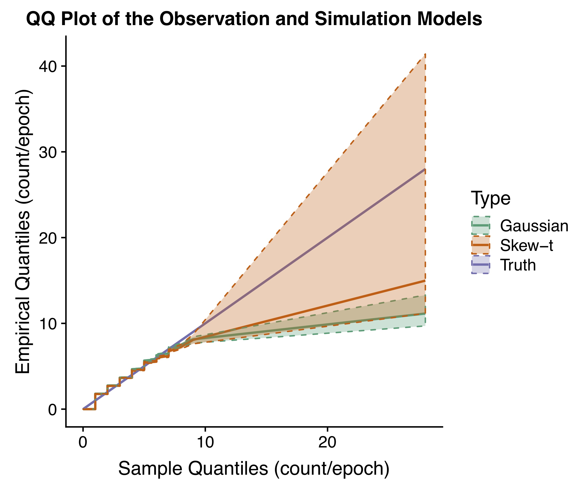

## Multi-Site High-Frequency Stochastic Precipitation Generator

This is a github repository for the paper entitled "Multi-Site High-Frequency Stochastic Precipitation Generator Using Censored Skew-Symmetric Distributions". The paper is currently under review.

This project is designed to propose a multi-site stochastic weather generator (SWG) to reproduce the statistical properties of high- frequency precipitation.

The motivating data was collected by Institute of Earth Surface Dynamics (IDYST) at the University of Lausanne in 2016 using eight Pluvimate acoustic rain gauges, designed by [Dryptich](http://www.driptych.com). The detailed description of the Pluvimate rain gauges can be found in Benoit et al. (2018)[1]. This instrument can measure precipitations at a 0.01mm and 30 second resolution by counting individual raindrops. From April 4th to April 14th, 2016, a total number of 230,400 observations were recorded by the network of eight rain gauges located within a radius of 1 km.

### Main Results

The following figure shows the performance comparison between our proposed model with skew-t errors and a similar model with Gaussian errors (Koch (2016)[2]). We show that our model can capture the high intensity better than existing methods.

### Required R packages
* Rmarkdown
* here
* downloader
* readr
* reshape2
* ggplot2
* dplyr
* sn
* geoR
* cowplot

### Run
To reproduce the tables and figures, one can clone or download the repository and run the files in the directory ./R.

The file "99_make_all.R" offers a simple one-click way to reproduce all of the results. It will take several hours to run the programs. 

One can also run the scripts one by one by following the steps below. All of the scripts are self explained and writen in either .R or .Rmd format.

1. (optional) 01_gather_data.R file provides a automatic way to obtain the data used in this study. The downloaded data are stored in /data directory. Since the datasets are alreadly uploaded, you do not have to run this script.
1. 02_describing_raw_data.Rmd file reads the raw data and provides some simple description.
1. 03_preprocessing_data.Rmd file preprocesses the raw data and save the preprocessed data to ./results directory as .Rdata files.
1. 04_estimating_parameters.Rmd file includes the algorithm to estimate the required parameters in our model and saves the fitted parameters to ./results directory as .Rdata files.
1. 05_inference_and_simulation.Rmd file provides the data simulation in order to reproduce the high-frequency rainfall. It also provides inferences based on the estimation results. Most of the results and figures are generated by this file.
1. 11 simulation study.Rmd includes the simulation study to validate our model and compare with others.
1. 99_make_all.R an automatic way to run all of the aforementioned files.

### Reference
* [1] [Stochastic Rainfall Modeling at Sub-kilometer Scale](https://agupubs.onlinelibrary.wiley.com/doi/full/10.1029/2018WR022817)
* [2] [A frailty-contagion model for multi-site hourly precipitation driven by atmospheric covariates](https://www.sciencedirect.com/science/article/pii/S0309170815000032)

### Author
- Yuxiao Li and Ying Sun

### License

- For academic and non-commercial use only.
- For commercial use, please contact yuxiao.li@kaust.edu.sa

### Poster

